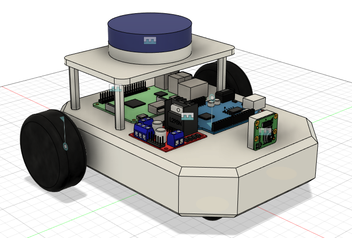
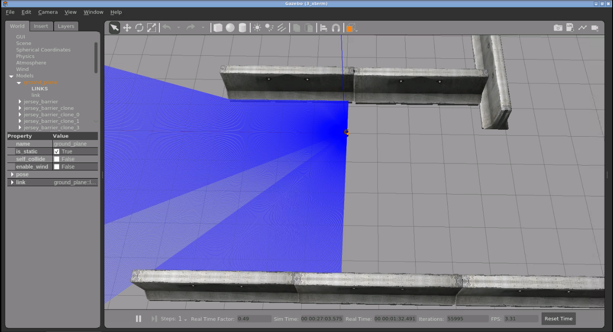
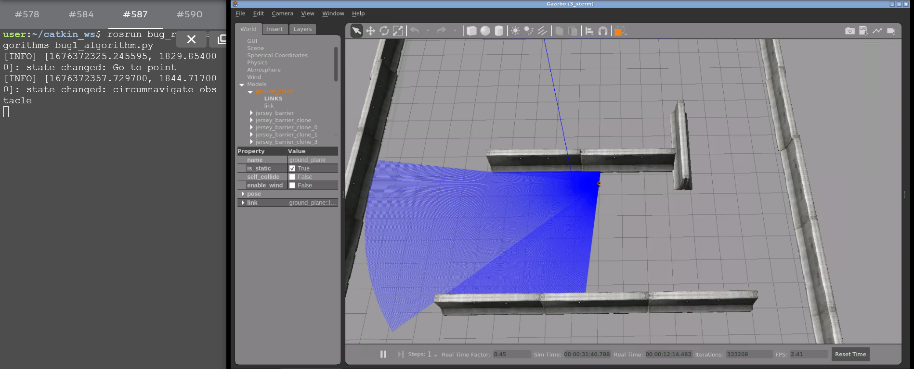
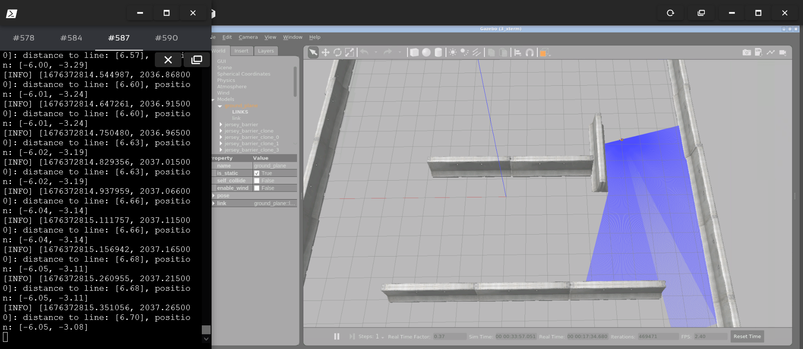

# BUG Robot
## Bug 0, 1, 2 Algorithms
<br>

&nbsp;

___________________________________________________________________________

# **Details About Project**

## Software Used
- Fusion360 -> For designing the 3D Model of the robot.
- [fusion2urdf](https://github.com/syuntoku14/fusion2urdf) -> Fusion360 script to export urdf from fusion 360 directly. 
- ROS - Noetic 
- Gazebo 
- Rviz 

Robot Drive Plugin Used - [Differential Drive - Gazebo](http://gazebosim.org/tutorials?tut=ros_gzplugins#DifferentialDrive)

## Fusion360 Model
<div align="center">

<br />
</div>

## Clone this repository inside your ROS Workspace:
```
cd ~/catkin_ws/src/
git clone https://github.com/nilutpolkashyap/bug_robot.git
cd ~/catkin_ws/
catkin_make
source devel/setup.bash
```

## Launch the simulation and visualization
Type the command in a terminal to launch the Bug Robot world simulation:
```
roslaunch bug_robot_description bug_world.launch
```
<div align="center">
</div><br />

## Run Bug 0 Algorithm
Type the command in a terminal to launch the Bug Robot world simulation:
```
roslaunch bug_robot_description bug_world.launch
```

Type the command in another terminal to launch Wall Following and Go-to-point nodes:
```
roslaunch bug_robot_algorithms bug0_pre.launch
```

Type the command in another terminal to run the Bug 0 algorithm:
```
rosrun bug_robot_algorithms bug0_algorithm.py
```

<div align="center"></div>


## Run Bug 1 Algorithm
Type the command in a terminal to launch the Bug Robot world simulation:
```
roslaunch bug_robot_description bug_world.launch
```

Type the command in another terminal to launch Wall Following and Go-to-point nodes:
```
roslaunch bug_robot_algorithms bug1_pre.launch
```

Type the command in another terminal to run the Bug 1 algorithm:
```
rosrun bug_robot_algorithms bug1_algorithm.py
```

<div align="center"></div>


## Run Bug 2 Algorithm
Type the command in a terminal to launch the Bug Robot world simulation:
```
roslaunch bug_robot_description bug_world.launch
```

Type the command in another terminal to launch Wall Following and Go-to-point nodes:
```
roslaunch bug_robot_algorithms bug2_pre.launch
```

Type the command in another terminal to run the Bug  algorithm:
```
rosrun bug_robot_algorithms bug2_algorithm.py
```

<div align="center"></div>

